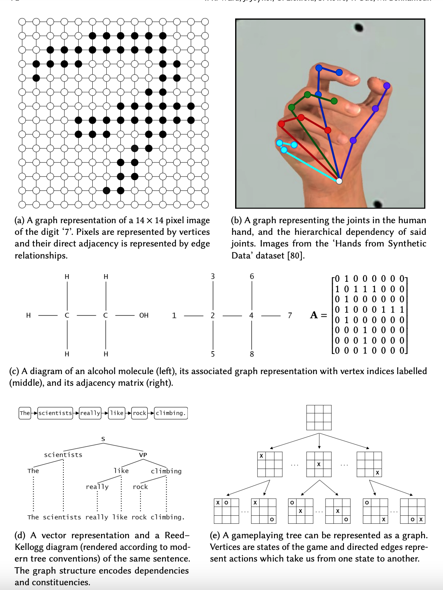

## Graph Neural networks

Graph Neural Network is a type of Neural Network which directly operates on the Graph structure. Three typical applications of GNN is node classification, edge classification, and graph classification or regressions. Essentially, every node in the graph is associated with a label, and we want to predict the label of the nodes without ground-truth.

In the node classification problem setup, each node v is characterized by its feature x_v and associated with a ground-truth label t_v. Given a partially labeled graph G, the goal is to leverage these labeled nodes to predict the labels of the unlabeled. It learns to represent each node with a d dimensional vector (state) h_v which contains the information of its neighborhood. 

GNNs can be used to deal the diverse datasets as shown below [^1]

## References
[^1]:https://arxiv.org/pdf/2010.05234.pdf
