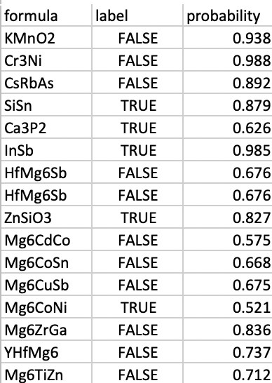

# 2D materials Predictor
#### By Wei Lai

## Manual

### Background on 2D materials Prediction

Two dimensional materials such as graphene and hexagonal boron nitride have the potential to create new electronics
and technologies such as spintronics, catalysis, and membranes owing to their exotic vibrational, electronic, optical magnetic, and topological behaviors. 2D compounds need to have requisite geometric and bonding criteria to make them relatively easy to exfoliate so that they can have potentially interesting physical and electromagnetic properties. Here we develop a composition based machine learning screening model [^1] to filter out potential 2D materials from millions of hypothetical materials compositions generated by our MATGAN algorithm [^2]. 

### The 2D materials classification model:

we employ the Random Forest (RF)  as the surrogate model for predicting the 2D probability given a
material’ Magpie composition features [^3]. Magpie feature set is calculated using the matminer library which
is a Python-based platform that facilitates data-driven methods for analyzing and predicting material properties by
calculating a variety of descriptors from material compositions or crystal structures. Magpie feature set summarizes 132
features about material composition information, such as atomic number in the material, range of melting temperature,
mean absolute deviation of valence. Those 132 features of each material will be calculated and used in our random
forest model training.

### Performance and Limitations

### Using the 2D material Predictor

#### Entering Inputs

Practically, the procedure for getting predictions consists in 4 steps

1. Provide a csv file of formulas or provide 1 or more material formulas separated by comma or space (no processing if file uploaded)
2. Click "Check Now"
3. Check if a crystal material with a given formula is a 2D or layered material and print the 2D materials formulas
4. Download detailed results by clicking link

#### Interpreting the Results
The result contains formula, label and probability

### Future features

In the future, we want to give the user the option to perform substitution of several ions for one ion in a starting structure.
For instance, if one is interested in ternary oxychlorides (M, O2-, Cl1-) there will be only few ternary compounds that will be good candidates for a substitution generating oxychlorides (e.g., oxybromides).
A strategy to increase the pool of possible structure is to allow substitution of one ion by O2- and Cl-.
For instance, we would start with an oxide and substitute the O2- by a mixture of O2- and Cl-.
The amount of O and Cl will be set to achieve charge balance and a simple model (electrostatics or other) could be used to pick an ordering of the two substituted species.

The only data mined model accessible now is the substitution predictor.
We have developed another model based on correlations between crystal structures at different compositions.[^3][^4] We plan to give access to this model in the future.
The two models are complimentary: the model based on correlations between structure is more efficient in data rich regions (e.g., ternary oxides) while the ionic substitution model is more efficient in data sparse regions (e.g., quaternaries).

### Citations

To cite the Structure Predictor App, please reference the following works:

- Song, Yuqi, Edirisuriya M. Dilanga Siriwardane, Yong Zhao, and Jianjun Hu. "Computational discovery of new 2D materials using deep learning generative models." ACS Applied Materials & Interfaces (2021).
- A. Jain, G. Hautier, C. J. Moore, S. P. Ong, C. C. Fischer, T. Mueller, K. A. Persson, and G. Ceder, A high-throughput infrastructure for density functional theory calculations, Computational Materials Science, vol. 50, 2011, pp. 2295-2310.

[^1]: Song, Yuqi, Edirisuriya M. Dilanga Siriwardane, Yong Zhao, and Jianjun Hu. "Computational discovery of new 2D materials using deep learning generative models." ACS Applied Materials & Interfaces (2021).
[^2]: Dan, Yabo, Yong Zhao, Xiang Li, Shaobo Li, Ming Hu, and Jianjun Hu. "Generative adversarial networks (GAN) based efficient sampling of chemical composition space for inverse design of inorganic materials." npj Computational Materials 6, no. 1 (2020): 1-7.
[^3]: Ward, Logan, Alexander Dunn, Alireza Faghaninia, Nils ER Zimmermann, Saurabh Bajaj, Qi Wang, Joseph Montoya et al. "Matminer: An open source toolkit for materials data mining." Computational Materials Science 152 (2018): 60-69.

### Authors

- Weilai
- Jianjun Hu
