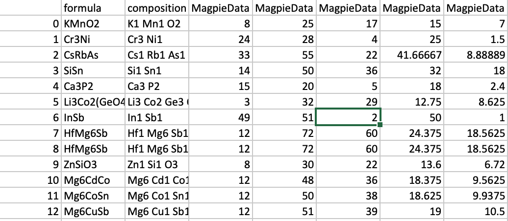

# Feature Generator
#### by Dr. Hu

## Manual

### Background

While our web apps can provide pretained models for various materials property prediction, more effective machine learning algorithms and descriptors are emerging all the time. It is desirable for algorithm developers to easily generate these popular materials features and try with their newly developed algorithms. Here this Feature Generator provides the capability to easily generate diverse compositional and structural features of materials for algorithm tinkering.

### The Feature Generation methods

We used the Materials Featurizer of the matminer package [^1] to generate the compositional and structural features. This package includes a large number of possible descriptors readily calculated from composition or structures. here for compositional features, we have included the Magpie, matminer, deml, matscholar, megnet features. For structural descriptors, we have included CGCNNfeatures, XRDPowerPattern, CloulombMatrix, OrbitalFieldMatrix, JarvisCFID, SitestatsFiingerprint, RadialDistribution, BagofBonds. Check the reference for more details of the list of features. More structural features can be calculated using the Dscribe [^3]. However, according to our recent benchmark, it is found that the graph neural networks always work much better than such structural descriptors [^2]. 

### Performance and Limitations

There are many more effective descriptors emerging all the time which are developed by experts or learned by deep learning based representation. We will add more such emerging features to our app. 

### Using the feature generator

#### Entering Inputs

Practically, the procedure for getting predictions consists in 3 steps

1. First select feature category: compositional, structural, or mixed features
2. Select target feature type
3. Input a material formula or a csv with a list of formulas. It will automatically use the composition machine learning model. You can also upload a structure cif file, it will select the graph neural network model accordingly. 
4. click "Generate now" and wait
4. click "Download now" link to collect the result or download the results csv file.

#### Interpreting the Results

The csv file contains all the calculated features along with the compositions.

### Future features

In the future, we want to add more feature/descriptors.

### Citations

If you use this App, please reference the following work:

- Ward, Logan, Alexander Dunn, Alireza Faghaninia, Nils ER Zimmermann, Saurabh Bajaj, Qi Wang, Joseph Montoya et al. "Matminer: An open source toolkit for materials data mining." Computational Materials Science 152 (2018): 60-69.
- Hu, Jianjun, Stanislav Stefanov, Yuqi Song, Sadman Sadeed Omee, Steph-Yves Louis, Edirisuriya Siriwardane, and Yong Zhao. "MaterialsAtlas. org: A Materials Informatics Web App Platform for Materials Discovery and Survey of State-of-the-Art." arXiv preprint arXiv:2109.04007 (2021).

[^1]: Ward, Logan, Alexander Dunn, Alireza Faghaninia, Nils ER Zimmermann, Saurabh Bajaj, Qi Wang, Joseph Montoya et al. "Matminer: An open source toolkit for materials data mining." Computational Materials Science 152 (2018): 60-69.
[^2]: https://arxiv.org/abs/2109.12283
[^3]: https://github.com/SINGROUP/dscribe

### Authors

- Jianjun Hu
