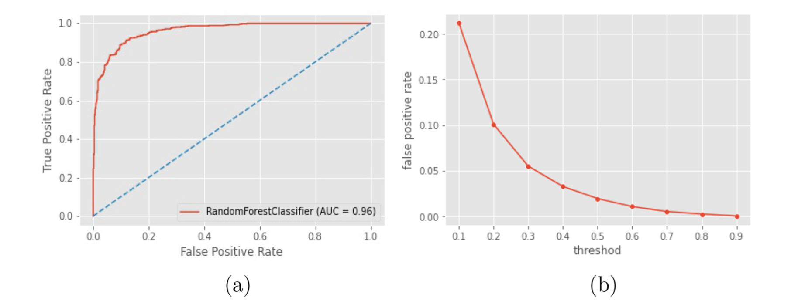

# Hypothetical 2D Materials (composition) Database
#### by Dr. Jianjun Hu

## Manual

### Background 
Two dimensional materials such as graphene and hexagonal boron nitride have the potential to create new electronics and technologies such as spintronics, catalysis, and membranes owing to their exotic vibrational, electronic, optical, magnetic, and topological behaviors. Although several thousand 2D materials have been screened in existing materials databases, discovering new 2D materials remains challenging. Here, we used a random forest-based 2D materials classifier [^1] to discover new hypothetical 2D materials.

### The Database Generation Method

We trained a machine learning model for classifying a given compositio into 2D or non-2D materials [^1]. We then apply this model to the 3 Million hypothetical materials compositions generated by the MATGAN algorithm as described in [^2]. 

#### The 2D Materials Machine learning Classifier: How it works

we employ the random forest (RF) as the surrogate model for predicting the 2D probability given a material’s Magpie composition features. The Magpie feature set [^3] is a well-known descriptor set for composition-based machine learning models; those features are calculated by the matminer library [^4], which is a Python- based platform that facilitates data-driven methods for analyzing and predicting material properties by calculating a variety of descriptors from material compositions or crystal structures. Basically, the Magpie feature set calculates the mean, mean absolute deviation, range, minimum, maximum, and mode for 22 different elemental properties for all the elements contained in a formula (132 features in total). This elemental property category includes attributes such as the maximum row on the periodic table, the average atomic number, and the range of atomic radii between all elements present in the material. Those 132 features of each material will be calculated and used in our random forest model training.

### Performance and Limitations

_Figure 1: Performance of our RF random forest classifier. (a) ROC curve and AUC score; (b) false-positive rates with different thresholds._

<!--  -->

Please note that the compositions in this databse is hypothetical and have no guarantee for its synthesizability of structural stablity. 

### Using the Database Search function

#### Entering Inputs

Practically, the procedure for getting predictions consists in 3 steps

1. Pick elements: Select on the periodic table what constituent elements comprise the chemical space you are interested in.
   For instance if you want to make predictions for battery materials based on Li, Mn and O, you should pick those three elements.
2. After the results are returned, you can further narrow down the search by typing in the top right input box with more specific partial formula, e.g. Li2
3. Interpret the results.
   

#### Interpreting the Results

The results pages provides a set of potential 2D materials compositions as recommended by our 2D materials classifier. 

### Future features

In the future, we want to generate more 2D materials candidates and also possibly predict their crystal structures using our crystal structure prediction algorithm.s

### Citations

To cite the Structure Predictor App, please reference the following works:

- Song, Y., Siriwardane, E. M. D., Zhao, Y., & Hu, J. (2021). Computational discovery of new 2D materials using deep learning generative models. ACS Applied Materials & Interfaces.
- Hu, J., Stefanov, S., Song, Y., Omee, S. S., Louis, S. Y., Siriwardane, E., & Zhao, Y. (2021). MaterialsAtlas. org: A Materials Informatics Web App Platform for Materials Discovery and Survey of State-of-the-Art. arXiv preprint arXiv:2109.04007.

[^1]: Song, Y., Siriwardane, E. M. D., Zhao, Y., & Hu, J. (2021). Computational discovery of new 2D materials using deep learning generative models. ACS Applied Materials & Interfaces.
[^2]: Dan, Y., Zhao, Y., Li, X., Li, S., Hu, M., & Hu, J. (2020). Generative adversarial networks (GAN) based efficient sampling of chemical composition space for inverse design of inorganic materials. npj Computational Materials, 6(1), 1-7.
[^3]: Ward, L.; Agrawal, A.; Choudhary, A.; Wolverton, C. General- purpose Machine Learning Framework for Predicting Properties of Inorganic Materials. npj Computational Materials 2016, 2, 1−7.
[^4]: Ward, L.; Dunn, A.; Faghaninia, A.; Zimmermann, N. E.; Bajaj, S.; Wang, Q.; Montoya, J.; Chen, J.; Bystrom, K.; Dylla, M.; et al. Matminer: An Open Source Toolkit for Materials Data Mining. Comput. Mater. Sci. 2018, 152, 60−69.

### Authors

- Jianjun HU
- Yuqi Song
