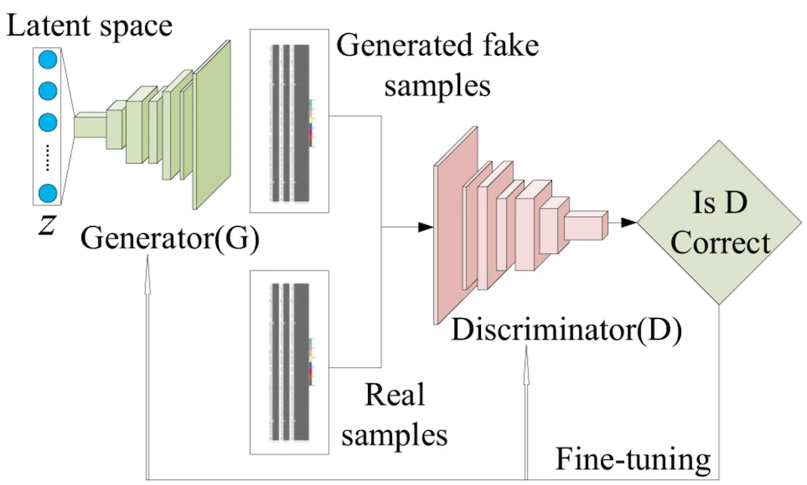
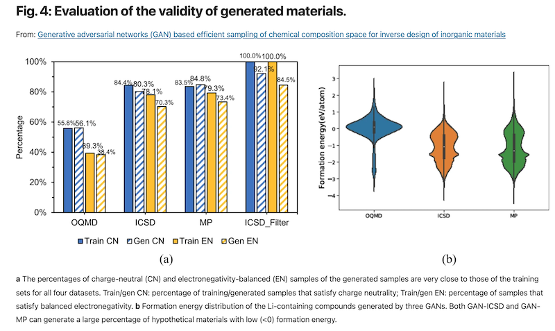
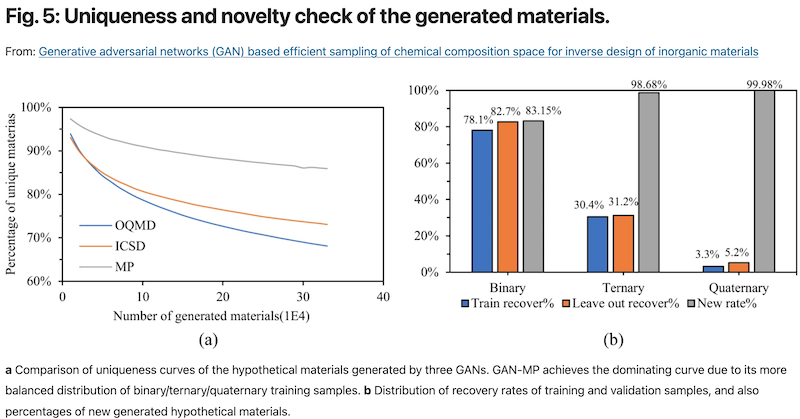

# Hypothetical Materiasl Composition Database

## Manual

### Background

This database includes the hypothetical materials compositions/formulas generated by our recent Generative Adversarial Network(GAN) based materials recipe generator (MATGAN) published on Nature npj Computational Materials in 2020 [^1].  The problem of generating new materials compositions is how to create candidates that satisfy all the basic chemical rules and are synthesizable to generate stable crystal structures. Rational design of new compositions based on several known chemical rules is not easy despite some local tinkering such as dopoing or element substitution is possible. Here we develop the MATGAN algorithm based on the GAN deep neural network model, which can learn implicit chemical rules embodied as the generator neural network model and use them to generate chemical valid candidate materials compositions. The formulas generated tend to observe the well-known chemical rules such as balanced charge and electronegativity and have valid oxidation states. 

### The Generation of New Materials Recipes/Compositions Method

The compound prediction model available on the Materials Project now, through the structure predictor app, is based on our recent work on the data mining of ionic substitutions.
In this section we will briefly explain the idea of the approach and how to use the explorer.
More details can be found in Hautier et al.[^2]

### The basic idea

_Figure 1: Generative models of materials compositions._

<!--  -->

### The compound generation procedure

Our generative adversal network (GAN) model for inorganic materials composition generation is trained with the formulas of known materials as deposited in Materials Project, ICSD or OQMD databases. Once it is trained, a simple run can generate new composition. 

### Performance and Limitations

<!-- 
_Figure 2: Generative models of materials compositions._

_Figure 3: Generative models of materials compositions._ -->

### Searching the hypothetical materials database

#### Entering Inputs

Practically, the procedure for getting predictions consists in 3 steps

1. Pick elements: Select on the periodic table what constituent elements comprise the chemical space you are interested in.
   For instance if you want to make predictions for battery materials based on Li, Mn and O, you should pick those three elements.

2. Pick oxidation states: The model uses the oxidation states to make predictions.
   V3+ does not substitute with the same elements as V5+, so if you want to study Mn3+ compounds, you should pick +3 for Mn, +1 for Li (no other choices anyway) and -2 for O.
   Sometimes you do not know what oxidation states you are interest in.
   Let say you want all Li-Mn-O compounds regardless of the oxidation state of Mn.
   Then, I would suggest running the model several times, one for Mn2+, one for Mn3+, and lastly one for Mn4+.
   This should cover all the chemical space you are looking at.

3. Start the prediction: click 'Predict Structure' to begin the prediction.
   Predictions are not immediately available and will require some time to complete.
   You can monitor the status of your request in the [dashboard](https://materialsproject.org/dashboard).

4. Examine results: Upon completion of the task, you will be given a link to a landing page providing details on the candidate structures.
   We also provide cif files for the predicted compounds as well as VASP files ready to be run with standard parameters.
   We do not provide any DFT results due our limited computational budget for the moment.
   It is the responsibility of the user to run the predictions.
   Also, as the pseudopotentials are proprietary in VASP (POTCARs) we do not provide those but a script is sent along that can be run to make sure the POTCARs are built from a directory containing all pseudopotentials.

#### Interpreting the Results

### Future features

To add more information to the hypothetical materials compositions, machine learning models of materials properties will be applied to the data entries to calculate their computed physical and chemical properties.

### Citations

To cite the Structure Predictor App, please reference the following works:

- Dan, Y., Zhao, Y., Li, X., Li, S., Hu, M., & Hu, J. (2020). Generative adversarial networks (GAN) based efficient sampling of chemical composition space for inverse design of inorganic materials. npj Computational Materials, 6(1), 1-7.
- Hu, J., Stefanov, S., Song, Y., Omee, S. S., Louis, S. Y., Siriwardane, E., & Zhao, Y. (2021). MaterialsAtlas. org: A Materials Informatics Web App Platform for Materials Discovery and Survey of State-of-the-Art. arXiv preprint arXiv:2109.04007.

### Authors
- Dr. Jianjun Hu

### References
[^1]: Dan, Y., Zhao, Y., Li, X., Li, S., Hu, M., & Hu, J. (2020). Generative adversarial networks (GAN) based efficient sampling of chemical composition space for inverse design of inorganic materials. npj Computational Materials, 6(1), 1-7.
[^2]: Hu, J., Stefanov, S., Song, Y., Omee, S. S., Louis, S. Y., Siriwardane, E., & Zhao, Y. (2021). MaterialsAtlas. org: A Materials Informatics Web App Platform for Materials Discovery and Survey of State-of-the-Art. arXiv preprint arXiv:2109.04007.
[^3]: 10.1021/cm100795d
[^4]: 10.1038/nmat1691

