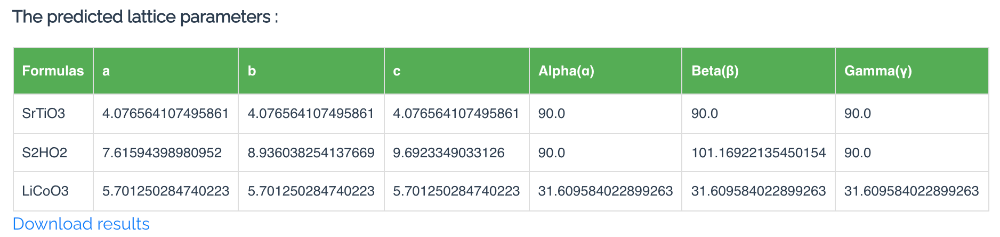

# Lattice Constants Predictor

## Manual

### Background

Given a material composition, predicting its unit cell lattice constants can help to determine its structures by human or they can be used as input to crystal structure prediction algorithm for prediction. 

### The Lattice Constants Prediction Method

The compound prediction model available on the Materials Project now, through the structure predictor app, is based on our recent work on the data mining of ionic substitutions.
In this section we will briefly explain the idea of the approach and how to use the explorer.
More details can be found in Hautier et al.[^2]

_Figure 1: An example of ionic substitution._

### Performance and Limitations

### Using the Lattice Constant Predictor

#### Entering Inputs

Practically, the procedure for getting predictions consists in 3 steps

1. Input a material formula in the input box  or upload a csv file with lists of formulas

2. Select the category of the input material (optional) 
   When the csv file is uploaded, then the predictor just uses the generic model.

3. Click "Predict Now"
4. collect the results by cliking the "Download the Results" Link.

#### Interpreting the Results

### Future features

We find that the prediction accuracy of lattice constants strongly depend on the crystal systems. More models over specialized categories of materials will be developed.

### Citations

To cite the Structure Predictor App, please reference the following works:

- Liang, Haotong, Valentin Stanev, A. Gilad Kusne, and Ichiro Takeuchi. "CRYSPNet: Crystal structure predictions via neural networks." Physical Review Materials 4, no. 12 (2020): 123802.
- Li, Yuxin, Wenhui Yang, Rongzhi Dong, and Jianjun Hu. "MLatticeABC: generic lattice constant prediction of crystal materials using machine learning." ACS omega 6, no. 17 (2021): 11585-11594.
- Hu, Jianjun, Stanislav Stefanov, Yuqi Song, Sadman Sadeed Omee, Steph-Yves Louis, Edirisuriya Siriwardane, and Yong Zhao. "MaterialsAtlas. org: A Materials Informatics Web App Platform for Materials Discovery and Survey of State-of-the-Art." arXiv preprint arXiv:2109.04007 (2021).

[^1]: Li, Yuxin, Wenhui Yang, Rongzhi Dong, and Jianjun Hu. "MLatticeABC: generic lattice constant prediction of crystal materials using machine learning." ACS omega 6, no. 17 (2021): 11585-11594.
[^2]: Liang, Haotong, Valentin Stanev, A. Gilad Kusne, and Ichiro Takeuchi. "CRYSPNet: Crystal structure predictions via neural networks." Physical Review Materials 4, no. 12 (2020): 123802.

### Authors

- Jianjun Hu
- Yuxin Li
