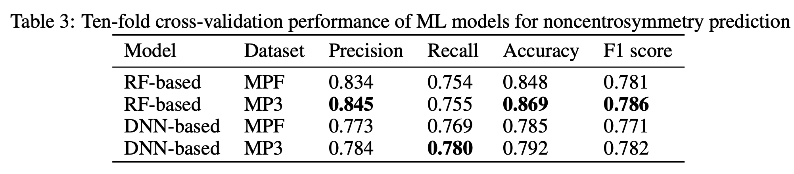
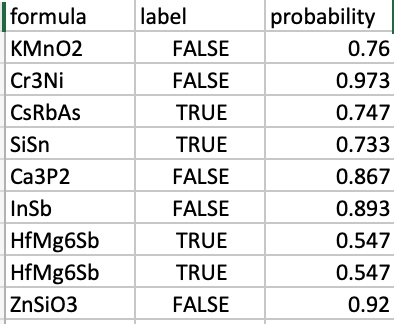

# Prediction of noncentrosymmetric materials
#### By Wei Lai

## Manual

### Background

Nonlinear optical materials (NLO), in which light waves interact with each other, are one of the key enablers for
next generation of new lasers, fast telecommunication, quantum computing, quantum encryption, dynamic or optical
storage data, and many other applications. NLO materials are most broadly defined as those compounds
capable of altering the frequency of light. Depending on the chemical and physical construct of the materials they can
combine multiple photons to generate shorter wavelength photons or split one photon into several new photons of longer
wavelengths. These new photons can be employed to perform all of the above applications as well as many others. The
classes of NLO materials range broadly from inorganic oxides such as KT iOP O4 and LiN bO3 to semiconductors
like to periodically poled GaAs, to organic polymers to metal organic framework (MOFs), and to simple small organic
molecules like stilbene. This broad range of materials has many different properties and characteristics but all are united
by one common factor, i.e. their lattice structure must not contain a center of symmetry and must be acentric.
This is a rigorous requirement that can only be met in well-ordered lattice structures, meaning ordered crystals. It is
generally difficult to design and grow acentric single crystals and less than 15% of all known structures are acentric

Here we develop a composition based machine learning screening model [^1] to discover potential noncentrosymmetric nonlinear materials from millions of hypothetical materials compositions generated by our MATGAN algorithm [^2]. 

### The noncentrosymmetric materials classification model:

We use the Matminer's composition featurizer’s Element Property module to calculate the Magpie elemental descriptors for training
our ML models. The Magpie feature set has 132 elemental descriptors, composed of 6 statistics of a set of elemental
properties such as atomic number in the material, space group of the material, the Magnetic Moment calculated by
Density Functional Theory (DFT). Magpie feature set was selected based on our evaluations of a couple of descriptors
we employ the Random Forest (RF)  as the model for predicting the probability for a given composition to be noncentrosymmetic given a
material’ Magpie composition features [^3]. Our training set is composed of 82,506 compositions in which 63,376 are symmetric and 19,130 are nonsymmetric.

### Performance and Limitations

 
### Using the noncentrosymmetric material Predictor

#### Entering Inputs

Practically, the procedure for getting predictions consists in 4 steps

1. Provide a csv file of formulas or provide 1 or more material formulas separated by comma or space (no processing if file uploaded)
2. Click "Check Now"
3. Check if a crystal material with a given formula is a 2D or layered material and print the 2D materials formulas
4. Download detailed results by clicking link

#### Interpreting the Results

### Future features

In the future, we want to improve performance with more advanced algorithm based on graph neural network.

### Citations

If you use this app, please reference the following works:

- Song, Yuqi, Joseph Lindsay, Yong Zhao, Alireza Nasiri, Steph-Yves Louis, Jie Ling, Ming Hu, and Jianjun Hu. "Machine Learning based prediction of noncentrosymmetric crystal materials." Computational Materials Science 183 (2020): 109792.
- Hu, Jianjun, Stanislav Stefanov, Yuqi Song, Sadman Sadeed Omee, Steph-Yves Louis, Edirisuriya Siriwardane, Yong Zhao, Lai Wei. "MaterialsAtlas. org: A Materials Informatics Web App Platform for Materials Discovery and Survey of State-of-the-Art." arXiv preprint arXiv:2109.04007 (2021).

[^1]: Song, Yuqi, Joseph Lindsay, Yong Zhao, Alireza Nasiri, Steph-Yves Louis, Jie Ling, Ming Hu, and Jianjun Hu. "Machine Learning based prediction of noncentrosymmetric crystal materials." Computational Materials Science 183 (2020): 109792.
[^2]: Dan, Yabo, Yong Zhao, Xiang Li, Shaobo Li, Ming Hu, and Jianjun Hu. "Generative adversarial networks (GAN) based efficient sampling of chemical composition space for inverse design of inorganic materials." npj Computational Materials 6, no. 1 (2020): 1-7.
[^3]: Ward, Logan, Alexander Dunn, Alireza Faghaninia, Nils ER Zimmermann, Saurabh Bajaj, Qi Wang, Joseph Montoya et al. "Matminer: An open source toolkit for materials data mining." Computational Materials Science 152 (2018): 60-69.

### Authors

- Wei Lai
- Jianjun Hu

