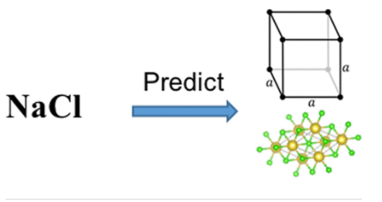
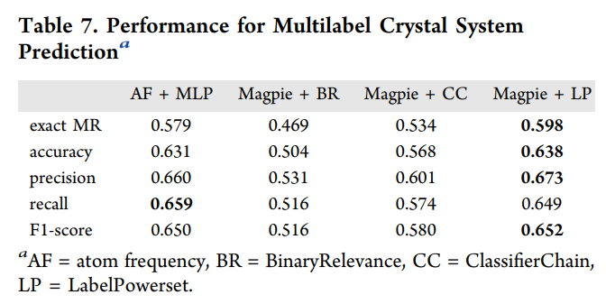

# Space group and Crystal Systems Predictor

## Manual

### Background

Structural information of materials such as the crystal systems and space groups are highly useful for analyzing their physical properties. However, the enormous composition space of materials makes experimental X-ray diffraction (XRD) or first-principle-based structure determination methods infeasible for large-scale material screening in the composition space. Here is a machine learning-based method for predicting space groups and crystal systems of inorganic materials, given only their compositional information. Such models allow us to conduct fast screening of millions of potential chemicals as done in [^4]. We evaluate three types of features/descriptors: Magpie, [^2] atom vector, [^3] and one hot encoding (atom frequency) as the inputs of our machine-learning algorithms. Neither XRD data nor DFT calculation is involved in feature calculations. Because of the fact that one composition may correspond to multiple crystal structures, four classifiers are developed to predict material structures in terms of the crystal system and space group: one-versus-all classifiers, multiclass classifiers, polymorphism classifiers, and multilabel classifiers. We leverage multi layer perceptron (MLP) and RF to analyze how those feature sets can help determine the crystal structure using 10 fold cross-validation. More details can be found in Yong Zhao et al.[^1]

### The Space group and Crystal Systems Prediction Method

We propose and evaluate machine-learning algorithms for predicting the crystal systems and space groups of materials merely from their Inorganic Materials Compositions. Two widely used machine learning algorithms including MLP and RF and three multilabel learning algorithms including BinaryRelevance (BR), ClassifierChain (CC) and LabelPowerset are evaluated in this study. Two popular machinelearning algorithms including RFs and multilayered perceptron neural networks combined with three material representations are evaluated for four types of structure classification problems for both crystal system prediction and space group prediction: one-vs-all binary classification, multiclass classification, polymorphism prediction, and multilabel classification. More details can be found in Yong Zhao et al.[^1]

_Figure 1: Figure of Space group and Crystal Systems Predictor._

### Performance and Limitations

The algorithms include MLP and three transformation algorithms (BinaryRelevance, ClassifierChain, and LabelPowerset) for multilabel classification, all using the RF as the
base classifier. Tenfold cross-validation is applied for performance evaluation. Table 7 shows the best results for each evaluated algorithm.

### Using the Structure Predictor

#### Entering Inputs

Practically, the procedure for getting predictions consists in 3 steps

1. Provide a csv file of formulas or provide 1 or more material formulas separated by comma or space (no processing if file uploaded).
2. Click "Check Now".
3. Collect the results by cliking the "Download the Results" Link.

#### Interpreting the Results

The result including: Formulas, Bravais System, Bravais System Prob, Spacegroups, Spacegroups Prob, a, b, c (atomic coordinates), Alpha(α), Beta(β), Gamma(γ) based on your input. You can download the csv file of the result by clicking "Download results". 

### Future features

In the future work, we may try to set a formation energy threshold to filter out those materials in the Materials Project dataset. In addition, our feature importance analysis shows that electronegativity, covalent radius, Mendeleev number, melting temperature, GAS volume pascal, and mean atomic weight are crucial factors for predicting the crystal system and space group for a given material composition. We also found that the ML performance for space group prediction is much lower than that of materials crystal system prediction given their composition. That is because the data is distributed more unevenly over 18 space groups in our study, which may call for more advanced techniques to address this issue.

### Citations

To cite the Structure Predictor App, please reference the following works:

- Zhao, Yong, et al. "Machine learning-based prediction of crystal systems and space groups from inorganic materials compositions." ACS omega 5.7 (2020): 3596-3606.
- Hu, Jianjun, Stanislav Stefanov, Yuqi Song, Sadman Sadeed Omee, Steph-Yves Louis, Edirisuriya Siriwardane, and Yong Zhao. "MaterialsAtlas. org: A Materials Informatics Web App Platform for Materials Discovery and Survey of State-of-the-Art." arXiv preprint arXiv:2109.04007 (2021).

### Authors
- Jianjun Hu
- Lai Wei

### References
[^1]: Zhao, Yong, et al. "Machine learning-based prediction of crystal systems and space groups from inorganic materials compositions." ACS omega 5.7 (2020): 3596-3606.

[^2]: Ward, L.; Agrawal, A.; Choudhary, A.; Wolverton, C. A general purpose machine learning framework for predicting properties of inorganic materials. npj Comput. Mater. 2016, 2, 16028.

[^3]: Zhou, Q.; Tang, P.; Liu, S.; Pan, J.; Yan, Q.; Zhang, S.-C. Learning atoms for materials discovery. Proc. Natl. Acad. Sci. U.S.A. 2018, 115, E6411−E6417.

[^4]: Jha, D.; Ward, L.; Paul, A.; Liao, W.-k.; Choudhary, A.; Wolverton, C.; Agrawal, A. ElemNet: Deep Learning the Chemistry of Materials From Only Elemental Composition. Sci. Rep. 2018, 8, 17593.
