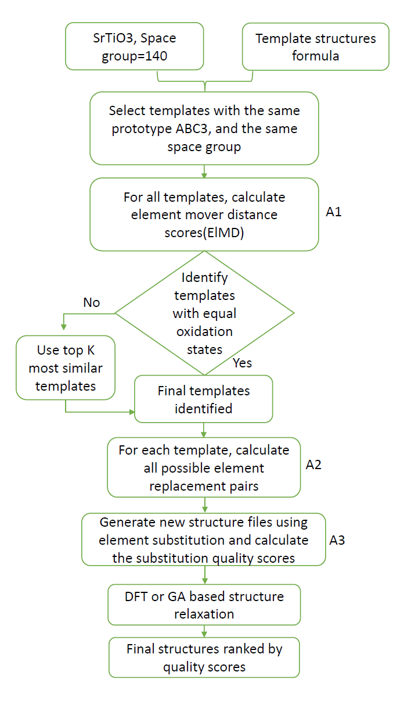

# TCSP: Template based Crystal Structure Predictor
#### By Lai Wei (魏涞)

## Manual

### Background on Template based Crystal Structure Prediction

Crystal structure prediction is an essential step of computational materials design or discovery. While many materials properties can be computed nowadays with _ab-initio_ computations, they usually requires the availability of the crystal structures. Those computed properties are only meaningful if they are evaluated on a compound (i.e., a stoichiometry and crystal structure) stable enough to be formed. Crystal structure prediction can be useful for experimentalists too.
For instance, when only powder XRD experiments are available after synthesis of a new compound, a theoretical suggestion of a likely structure can tremendously help the structure refinement and determination for example.

The most common approach in the field of crystal structure prediction is to treat it as an optimization problem. [^2]
Researchers use optimization algorithms to search for the minimum of the relevant thermodynamic potential (e.g., the energy at 0 K, 0 atm) by varying the crystal's degrees of freedom (lattice constants, atomic positions). This optimization is extremely challenging as the energy landscape is very rugged and full of local minima and the energy evaluation using DFT is very computationally expensive and slow. Advanced optimization techniques (e.g., simulated annealing and genetic algorithm) are usually necessary to tackle this optimization problem. TCSP chooses a simpler but much faster approach for crystal structure prediction using template based element subsitition. A related work is the paper in [^3]

### The Template/Substitution based Structure Prediction Method

The crystal structure prediction model available on the MaterialsAtlas is based on our recent work on the template based crystal structure prediction.
In this section we will briefly explain the idea of the approach and how to use the TCSP app.
More details can be found in L.Wei et al. [^1]

### The basic idea

_Figure 1: Flowchart of TCSP algorithm._

Our template-based crystal structure prediction algorithm is illustrated in Figure 1. Given an input formula (e.g., SrTiO3), the user can choose to specify the expected space group number for predicted structures (e.g., space group=140). The TCSP algorithm can search structure templates with the same prototype (sometimes called an anonymous formula) (e.g., ABC3) and the same space group if specified. It uses an Element’s mover distance (ElMD) to measure the composition similarity between the query formula and the compositions of all the template structures then pick the top K structures as template candidates with the smallest composition distances. Then the TCSP algorithm can get a final template list using the Pymatgen package to estimate its oxidation states and compare them to those of the query formula. If no such templatesare found, TCSP algorithm neglects the oxidation match requirements and directly adds them as final templates. For each template, calculate all possible element replacement pairs using algorithm 2. A replacement quality score is also calculated for each such element substitution arrangement using the procedure as described in Module 3. The resulting structures will then be subject to DFT or machine learning-based structure relaxation, which can be further used to calculate formation energy, e-above-hull energy, and phonon dispersion for validation.

<!-- It is common for chemists to propose new compounds from the substitution of
another, chemically similar, ion.
For instance, as illustrated in Figure 1, knowing that BaTiO3 forms a perovskite structure,
one can deduct that it is likely for another chemically similar ion as Ca2+ to form the same structure.
We have
implemented a mathematical model that learns these substitution rules from a database of experimentally
observed crystal structure (e.g., the ICSD).
Basically, what the model provides is a probability
distribution for any ionic substitution.
In Figure 2 we show the matrix indicating the data mined
substitution tendency for two ionic species obtained from this work.
The ions have been sorted by Mendeleev number and therefore groups of chemically similar ions (e.g., the transition metals) are grouped together.
Red colors indicate that two ions
tend to substitute while blue is associated with pair of species not substituting to each other. -->

<!-- 
_Figure 2: Data mined tendency for ionic substitutions.
Red indicates high substitution tendency.
Blue indicates that the tow ions tend to not substitute._ -->

### The compound prediction procedure

<!-- The product of our data mining approach is a probability function indicating how likely is a specific set of ionic substitutions.
The model we used was inspired by previous work in the field of machine translation.
In this field, it is the probability for a word in one language to be able to be substituted by a word in another language.
In our case, we substitute ions rather than words.
After we built this probability function, from a database of experimental data (here the ICSD), we can perform compound predictions.
Figure 3 illustrates the procedure for 4 ions (but this can be generalized to any number of species).
Targeting a specific combination of 4 ions (e.g., Ba2+, Fe3+, La3+, O2- ), we look for any substitution from known compounds (in the ICSD) that have a high enough probability to be likely to form a new stable compound.
If the substitution is higher than a certain threshold we keep it as a possible candidate, otherwise we discard it and go to the next ICSD compound.
There is also a check to make sure we do not form duplicate structures and only predict charge balanced compounds. -->

### Performance and Limitations

### HOW TO: Using the Structure Predictor

#### Entering Inputs

Practically, the procedure for getting predictions consists in 4 steps

1. Input the query formula， 
2. Select the space group of target structure. Input 0 if do not want to specify
3. Input your email to receive download link of predicted results
4. Click Predict Now button

#### Interpreting the Results

After receiving the notification email, download and unzip the result file:

1. results.txt
2. similar_formulas.csv
3. tempaltesCandidates.csv
4. score-mp-mpid.cif files.

results.txt: Producer output

similar_formulas.csv: Based on the distance score, we pick the top 100 templates with the same prototype of the query formula

tempaltesCandidates.csv: Final template Candidates

score-mp-mpid.cif files: New materials structure files. The first number is the MlED distance score calculated by Algorithm 1, which represents the similarity between the template formula and the query formula. The smaller the distance score, the higher the similarity. The mpid represents the id of the template formula in the material project database.

<!-- The results pages provides a set of structure id's corresponding to the candidate structures.
A link is provided for each structure id, which provides structure visualization, lattice vectors, atomic positions, and simulated x-ray spectra.
Cif and POSCAR files for each candidate can be downloaded.
Typically, the candidates need to be tested for stability against each other (seeing what is the lowest energy structure amongst the candidates at a given composition) but also against other phases known in nature.
For instance, if a AB compound is proposed and its energy is higher than a combination of half A2B and half AB2.
This stability analysis can be performed using the convex hull construction that will effectively test the stability of the phases against each other and come with a set of stable phases that are on the hull.
Figure 4 shows a convex hull (in green) for an A-B system.
Blue points indicate phases that are not on the hull and therefore unstable and red points indicate stable phases.
For instance, the construction shows directly that the phase γ at AB will decompose into α1 and β2.

_Figure 4: An example of the convex hull construction._

More information about phase stability and convex hull can be obtained in the [phase diagram app manual](phase-diagram.md).

Please note that we only presented an approach for building zero K, zero pressure phase diagrams.
It is possible to use the candidates proposed by the model to perform more advanced stability studies for instance at finite temperature.
This is more expensive computationally though as the different entropy components (configuration, vibration, etc...) need to be taken into account.

Finally, as we present a usage of our candidates for computations, an experimentalist can also use these candidates to test different structures versus a powder diffraction pattern. -->

### Future features

To speed up the prediction algorithm, we will implement a template prototype idea, in which each composition prototype will only provide unique structure prototypes are templates to avoid the slow running due to too many duplicate/redundant/similar templates such as the Perovskite cubic templates.

<!-- In the future, we want to give the user the option to perform substitution of several ions for one ion in a starting structure.
For instance, if one is interested in ternary oxychlorides (M, O2-, Cl1-) there will be only few ternary compounds that will be good candidates for a substitution generating oxychlorides (e.g., oxybromides).
A strategy to increase the pool of possible structure is to allow substitution of one ion by O2- and Cl-.
For instance, we would start with an oxide and substitute the O2- by a mixture of O2- and Cl-.
The amount of O and Cl will be set to achieve charge balance and a simple model (electrostatics or other) could be used to pick an ordering of the two substituted species.

The only data mined model accessible now is the substitution predictor.
We have developed another model based on correlations between crystal structures at different compositions.[^3][^4] We plan to give access to this model in the future.
The two models are complimentary: the model based on correlations between structure is more efficient in data rich regions (e.g., ternary oxides) while the ionic substitution model is more efficient in data sparse regions (e.g., quaternaries). -->

### Citations

To cite the Structure Predictor App, please reference the following works:

- Wei, Lai, Nihang Fu, Edirisuriya Siriwardane, Wenhui Yang, Sadman Sadeed Omee, Rongzhi Dong, Rui Xin, and Jianjun Hu. "TCSP: a Template based crystal structure prediction algorithm and web server for materials discovery." arXiv preprint arXiv:2111.14049 (2021).
- Hu, Jianjun, Stanislav Stefanov, Yuqi Song, Sadman Sadeed Omee, Steph-Yves Louis, Edirisuriya Siriwardane, and Yong Zhao. "MaterialsAtlas. org: A Materials Informatics Web App Platform for Materials Discovery and Survey of State-of-the-Art." arXiv preprint arXiv:2109.04007 (2021).

### Authors
- Jianjun Hu
- Lai Wei

### References
[^1]: Wei, Lai, Nihang Fu, Edirisuriya Siriwardane, Wenhui Yang, Sadman Sadeed Omee, Rongzhi Dong, Rui Xin, and Jianjun Hu. "TCSP: a Template based crystal structure prediction algorithm and web server for materials discovery." arXiv preprint arXiv:2111.14049 (2021).

[^2]: Glass, Colin W., Artem R. Oganov, and Nikolaus Hansen. "USPEX—Evolutionary crystal structure prediction." Computer physics communications 175, no. 11-12 (2006): 713-720.

[^3]: G. Hautier, V. Ehrlacher, C.C. Fischer, A. Jain, G. Ceder, Data Mined Ionic Substitutions for the Discovery of New Compounds, Inorganic Chemistry, vol. 50, 2011, pp. 656-663.
